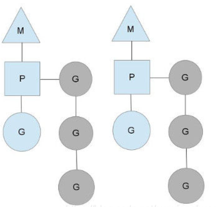

# 1. 通用基础

## Go语言中是如何实现继承的

在Go语言中，可以通过结构体组合来实现继承，示例如下：

```go
type People struct {
    Name string
}

// 这里Student继承了People，具有People的属性
type Student struct{
    People
    Grade int
}

```

## go struct 能不能比较

原理参考：https://cloud.tencent.com/developer/article/1825054

- 不同类型的 struct 之间不能进行比较，编译期就会报错（GoLand 会直接提示）
- 同类型的 struct 也分为两种情况
  - struct 的所有成员都是可以比较的，则该 strcut 的不同实例可以比较
  - struct 中含有不可比较的成员（如 Slice），则该 struct 不可以比较

## make和new的区别

原理参考：http://c.biancheng.net/view/5722.html

- make只能用来分配及初始化类型为 slice、map、chan 的数据。new 可以分配任意类型的数据
- new 分配返回的是指针，即类型 *Type。make 返回引用，即 Type
- new 分配的空间被清零。make 分配空间后，会进行初始化

## Go的参数是值传递还是指针传递

原理参考：https://zhuanlan.zhihu.com/p/383737884; https://segmentfault.com/a/1190000037763005

- Go中所有的参数传递都是**值传递**，拷贝的都是一个副本。
- 值传递时要么是该值的副本，要么是指针的副本（比如指向切片底层数组指针的副本）

## 为什么无法捕获其它goroutine的异常

这是由于goroutine的设计导致的。goroutine被设计成一个独立的执行单元，拥有自己的执行栈，不与其它goroutine共享任何数据。这就意味着goroutine无法拥有返回值和自身的ID编号等，已经无法捕获到其它goroutine的异常。

如果硬是要捕获其它goroutine的异常也不是不可以，但方法不太完美。做法是定义一个全局的channel用来捕获panic，子goroutine利用recover函数捕获到异常后就将异常写入这个全局的channel。之所以说这个方法不太完美是因为每个goroutine都要保证捕获到异常并且写入到全局的channel中，此外除了可恢复的错误外，还有一些不可恢复的运行时的panic（map的并发读写）。

# 2. 逃逸分析

## 什么是逃逸分析

（1）逃逸分析是指编译器对静态代码进行分析后，对内存管理进行优化和简化

（2）逃逸分析可以决定一个变量是分配到栈上还是分配到堆上

## 逃逸的类型

（1）指针逃逸: 函数返回了对象的指针

```go
func a() *int {
    v := 0
    // v 会放在堆上而不是栈上
    return &v
}

func main() {
    i := a()
    fmt.Println(i)
}
```

（2）空接口逃逸：如果函数的参数是interface{}， 函数的实参很可能逃逸

```go
func main() {
    // i 会放在堆上而不是栈上
    i := 10
    fmt.Println(i)
}
```


## 变量什么时候放到栈上什么时候放到堆上

（1）如果变量在函数外部没有被使用，则**优先**放到栈上

（2）如果变量在函数外面存在被引用，则**必定**放到堆上

（3）定义了一个很大的数组切片等，需要申请的内存过大也会分配到堆上

（4）编译期间很难确定具体类型的，也会发生逃逸

如：

```go
fmt.Println(*x) // Println的参数是interface类型，所以x也发生了逃逸
```

## 如何确定是否发生了逃逸

（1）编译时使用`-gcflags '-m -l'`

```shell
# gcflags 用于启用编译器支持的额外标志，如-m
# -m 表示输出编译器优化细节
# -l 禁止内联
go build -gcflags '-m -l' main.go
```

（2）查看反汇编

```shell
# 查看是否调用了newObject函数（在堆上分配内存）
go tool compile -S main.go
```

## Go 和 C/C++ 的堆栈的区别

（1）C/C++的堆栈是操作系统层级的概念，它的栈可以用来保存局部变量或者函数调用栈等等

（2）Go 语言的堆栈本质上是Go运行时向操作系统申请的堆空间，用来构造逻辑上的堆栈，所以其“栈空间”比C/C++的大得多；为了防止内存碎片话，会在适当的时候对整个栈空间进行一次深拷贝，将其复制到另一片内存区域，所以在Go中指针运算不能奏效

# 3. slice

## 切片和数组的区别

- 数组的长度是固定的，而切片是可变长的
- 数组作为函数参数是值传递，而切片作为函数参数时传递的是指针（本质也是值传递，是指向底层数组指针的副本）
- 切片有一个指向底层数组的指针

## 切片的底层结构是怎么样的

切片的数据机构是由长度、容量以及指向底层数组的指针这三个字段组成。

- 长度：切片中现存有效元素的个数
- 容量：切片能存储元素的多少
- 指向底层数组的指针：记录其底层数组的地址，也正是切片开始的位置

```go
type slice struct {
	array unsafe.Pointer	//指向底层数组的指针
	len int					//切片长度
	cap int					//切片容量
}
```

下图展示了一个Go切片的底层数据结构，这个切片的长度为3，容量为6。


## 切片是否是线程安全的

示例参考：https://blog.csdn.net/AXIMI/article/details/119216785

Go语言实现线程安全常用的几种方式:1.互斥锁；2.读写锁；3.原子操作；4.sync.once；5. sync.atomic；6.channel slice底层结构并没有使用加锁等方式，不支持并发读写，所以并不是线程安全的，使用多个goroutine对类型为slice的变量进行操作，每次输出的值大概率都不会一样，与预期值不一致; **slice在并发执行中不会报错，但是数据会丢失**。

## 切片分配在栈上还是堆上

有可能分配到栈上，也有可能分配到栈上。当开辟切片空间较大时，会逃逸到堆上。

通过命令`go build -gcflags "-m -l" xxx.go`观察golang是如何进行逃逸分析的

```go
package main

func main() {
	_ = make([]string, 200)		 	//1
    // _ = make([]string, 20000)		//2
}

// output
// 1. make([]string, 200) does not escape
// 2. make([]string, 20000) escapes to heap

```

## 切片是怎么扩容的

使用append向slice追加元素时，如果slice空间不足，则会触发slice扩容，扩容实际上是分配一块更大的内存，**将原slice的数据拷贝进新slice，然后返回新slice**，扩容后再将数据追加进去。

切片扩容的策略：

- 当需要的容量超过原切片容量的两倍时，会使用需要的容量作为新容量
- 当原切片长度小于1024时，新切片的容量会直接翻倍
- 当原切片的容量大于等于1024时，会反复地增加1/4，直到新容量超过所需要的容量，这种说法不大准确，因为可能还要进行内存对齐，所以最终也有可能大于1.25倍

## 切片用copy和左值进行初始化的区别

- copy(slice2, slice1)实现的是深拷贝。拷贝的是数据本身，创造一个新对象，新创建的对象与原对象不共享内存，新创建的对象在内存中开辟一个新的内存地址，新对象值修改时不会影响原对象值。 同样的还有：遍历slice进行append赋值
- 如slice2 := slice1实现的是浅拷贝。拷贝的是数据地址，只复制指向的对象的指针，此时新对象和老对象指向的内存地址是一样的，新对象值修改时老对象也会变化。默认赋值操作就是浅拷贝。

## 切片插入新元素时需不需要重新写入（没有扩容）

当在尾部追加元素时，不需要重新写入;

```go
var a []int
a = append(a, 1)
```

在头部插入时；会引起内存的重分配，导致已有的元素全部重新写入；

```go
a = append([]int{0}, a...);
```

在中间插入时，会局部重新写入，如下： 使用链式操作在插入元素，在内层append函数中会创建一个临式切片，然后将a[i:]内容复制到新创建的**临时切片**中，再将临式切片追加至a[:i]中。

```go
a = append(a[:i], append([]int{x}, a[i:]...)...) 
a = append(a[:i], append([]int{1, 2, 3}, a[i:]...)...)//在第i个位置上插入切片
```

## nil切片和空切片的区别

nil切片和空切片指向的地址不一样。nil空切片引用数组指针地址为0（无指向任何实际地址）；空切片的引用数组指针地址是有的，且固定为一个值。

```go
package main

import (
    "fmt"
    "reflect"
    "unsafe"
)

func main() {
    
    var s1 []int
    s2 := make([]int,0)
    s4 := make([]int,0)
    
    fmt.Printf("s1 pointer:%+v, s2 pointer:%+v, s4 pointer:%+v, \n", *(*reflect.SliceHeader)(unsafe.Pointer(&s1)),*(*reflect.SliceHeader)(unsafe.Pointer(&s2)),*(*reflect.SliceHeader)(unsafe.Pointer(&s4)))
    fmt.Printf("%v\n", (*(*reflect.SliceHeader)(unsafe.Pointer(&s1))).Data==(*(*reflect.SliceHeader)(unsafe.Pointer(&s2))).Data)
    fmt.Printf("%v\n", (*(*reflect.SliceHeader)(unsafe.Pointer(&s2))).Data==(*(*reflect.SliceHeader)(unsafe.Pointer(&s4))).Data)
}

// s1 pointer:{Data:0 Len:0 Cap:0}, s2 pointer:{Data:824634207952 Len:0 Cap:0}, s4 pointer:{Data:824634207952 Len:0 Cap:0}, 
// false //nil切片和空切片指向的数组地址不一样
// true  //两个空切片指向的数组地址是一样的，都是824634207952
```


**所有的空切片指向的数组引用地址都是一样的**


# 4. Map

## Map的实现有哪些方案

实现map的主要数据结构有两种：哈希查找表（Hash Table）和搜索树（Search Tree）

（1）哈希查找表是利用哈希函数将key分配到不同的桶中（bucket），但可能会存在哈希冲突

（2）搜索树一般采用的是自平衡搜索树，包括AVL树、红黑树等

自平衡搜索树的最差效率是O(logN), 而哈希查找表是O(N)。但哈希查找表的最好查找效率是O(1)，如果哈希函数设计得好，最坏情况基本不会发生；遍历自平衡搜索树的时候，返回的key序列一般是按照从小到大的顺序，而遍历哈希查找表的时候则是乱序的。

## 怎么解决hash冲突

一般有两种常用的方法来解决哈希冲突：链表法和开放地址法

- **链表法**：将一个 bucket（桶）实现成一个链表，落在同一个 bucket 中的 key 都会插入这个链表（go语言使用的方法）
- **开放地址法**：碰撞发生后，通过一定的规律，在数组的后面挑选“空位”，用来放置新的 key

## Go 是怎么实现map的

go语言是利用哈希查找表来实现map的，并且采用链表法来解决哈希冲突。

## 为什么一个桶里最多装8个key-value

## 超过8个key-value落到当前桶怎么办

## key和value为什么要分开存储

## slice和map作为函数参数时有什么区别

## key的定位过程是怎么样的

## 什么时候会导致map扩容

## map的扩容过程是怎么样的

## map的遍历过程是怎么样的

## map中的key为什么是无序的

## map是线程安全的吗

不是。

（1）在查找、赋值、遍历、删除的过程中都会检测写标志位，一旦发现写标志置位（等于1），则直接panic

（2）在赋值和删除时，如果检测到写标志位是复位状态（等于0），会先将写标志位置位再进行其它操作

## float类型可以作为map的key吗

可以，除了slice、map、functions这几种类型，其它任何可比较的类型都可以作为map的key。但由于精度问题，可能会导致一些很诡异的问题发生。

## map如何实现两种get操作

两种get操作是指：

```go
age := ageMap["lgc"]
age, ok := ageMap["lgc"]
```


## 如何比较两个map是否相等

## 可以对map的元素取地址吗

## map可以边遍历边删除吗

 

# 5. channel

## 什么是channel

（1）Channel 在 gouroutine 间架起了一条管道，在管道里传输数据，实现 gouroutine 间的通信；

（2）在并发编程中它线程安全的，所以用起来非常方便

（3）channel 还提供“先进先出”的特性

（4）它还能影响 goroutine 的阻塞和唤醒。

## channel 有哪些应用场景

（1）用来做停止信号。比如通过关闭或者向某个channel发送一个元素使得接收方获取到这一信息，进而进行其它操作，比如结束for循环或者goroutine等

（2）用来做定时任务：即超时控制或者定期执行某个任务

```go
// 超时控制
select {
    case <- time.After(100*time.Millisecond)
    case <- s.stopc:
    	return false
}

// 定期任务
func worker() {
    ticker := time.Tick(1*time.Second)
    for {
        select {
            casa <- ticker:
            fmt.Println("执行1s定时任务")
        }
    }
}
```

（3）解耦生产者和消费者

生产者只管往channel里发送任务，然后消费者从channel里获取任务来执行，两种没有太大的耦合性

```go
func main() {
    taskCh := make(chan int, 100)
    go worker(taskCh)
    
    // 生产者往channel里发送任务
    for int i := 0; i < 10; i++ {
        tashCh <- i
    }
    
    select{
        case <- time.After(time.Hour):
    }
}

func worker(taskCh <- chan int) {
    const N = 5
    for i := 0; i < N; i++ {
        go func(id int) {
            for {
                // 消费者从channel里获取任务
                task := <-taskCh
                fmt.Printf("finish task: %d by worker:%d", task, id)
                time.Sleep(time.Second)
            } 
        }(i)
    }
}
```

（4）控制并发数。比如利用channel来控制token的数量，只有拿到令牌才能往下执行，执行完毕后将令牌归还

```go
token := make(chan int, 3)
func main() {
    for _, w := range work {
        go func() {
            token <- 1
            w()
            <-token // 归还令牌
        }()
    }
}
```

上述的代码应该注意当w内可能发送panic，这样令牌就可能无法归还，不过这可以用defer来保证。

## 对closed的channel进行操作会怎么样

（1）读已关闭的channel。如果在关闭前，通道内部有元素，会正确读到元素的值；如果关闭前通道无元素，则会读取到通道内元素类型对应的零值。但是若遍历通道，如果通道未关闭，读完元素后，会报死锁的错误。

（2）写已关闭的通道。会引发panic: send on closed channel

（3）关闭已关闭的通道。会引发panic: close of closed channel

总的来说：对于一个已初始化，但并未关闭的通道来说，收发操作一定不会引发 panic。但是通道一旦关闭，再对它进行发送操作，就会引发 panic。如果我们试图关闭一个已经关闭了的通道，也会引发 panic。

```go
//1. 读一个已经关闭的通道
func main() {
	channel := make(chan int, 10)
	channel <- 2
	close(channel)
	x := <-channel
	fmt.Println(x)
}
/*[Output]: 不会报错，输出2*/

// 遍历读关闭通道
func main() {
	channel := make(chan int, 10)
	channel <- 2
	channel <- 3
	close(channel) //若不关闭通道，则会报死锁错误
	for num := range channel {
		fmt.Println(num)
	}
}
/*[Output]: 不会报错，输出2 3*/

//2. 写一个已经关闭的通道
func main() {
    channel := make(chan int, 10)
    close(channel)
    channel <- 1
}
/*[Output]: panic: send on closed channel*/

//3. 关闭一个已经关闭的管道
func main() {
    channel := make(chan int, 10)
    close(channel)
    close(channel)
}
/*[Output]: panic: close of closed channel */
```

## 对nil channel进行操作会怎么样

（1）关闭一个nil channel会panic

（2）读、写一个nil channel都会被无限阻塞

```go
// 1. 关闭一个nil channel
func main() {
	var nilChan chan int
	close(nilChan)
}
/*output: panic: close of nil channel*/

// 读一个nil channel
func main() {
	var nilChan chan int
	fmt.Println("before read")
	<-nilChan
	fmt.Println("after read")
}
// output
// before read
// fatal error: all goroutines are asleep - deadlock!

// 3. 写一个nil channel
func main() {
	var nilChan chan int
	fmt.Println("before write")
	nilChan <- 5
	fmt.Println("after write")
}
// output
// before write
// fatal error: all goroutines are asleep - deadlock!
```

## 在同一个goroutine里读写无缓冲channel会怎么样

同一个协程里，不能对无缓冲channel同时发送和接收数据，如果这么做会直接报错死锁。对于一个无缓冲的channel而言，只有不同的协程之间一方发送数据一方接受数据才不会阻塞。channel无缓冲时，发送阻塞直到数据被接收，接收阻塞直到读到数据。

```go
func main() {
	ch := make(chan int)
	ch <- 1
	<-ch
}
// output
// fatal error: all goroutines are asleep - deadlock!
```

## channel和锁的区别

并发问题可以用channel解决也可以用Mutex解决，但是它们的擅长解决的问题有一些不同。

- channel关注的是并发问题的数据流动，适用于数据在多个协程中流动的场景。
- mutex关注的是是数据不动，某段时间只给一个协程访问数据的权限，适用于数据位置固定的场景。

## channel是不是线程安全的

（1）channel是成线程安全。 不同协程通过channel进行通信，本身的使用场景就是多线程，为了保证数据的一致性，必须实现线程安全。

（2）channel如何实现线程安全的? channel的底层实现中， hchan结构体中采用Mutex锁来保证数据读写安全。在对循环数组buf中的数据进行入队和出队操作时，必须先获取互斥锁，才能操作channel数据。

## 为什么在函数参数中传递channel时不需要传递指针

因为创建channel时调用的函数是makechan函数。它返回的是一个hchan的指针。channel在函数间传递都是使用的这个指针，这就是为什么函数传递中无需使用channel的指针，而是直接用channel就行了，因为channel本身就是一个指针

```go
func makechan(t *chantype, size int64) *hchan
```

## channel的底层有哪些重要数据结构

（1）buf指向一个底层的循环数组，只有设置为有缓存的channel才会有buf

（2）sendx和recvx分别指向底层循环数组的发送和接收元素位置的索引

（3）sendq和recvq分别表示发送数据的被阻塞的goroutine和读取数据的goroutine，这两个都是一个双向链表结构

（3）还有一个lock是用来保证每个读channel或者写channel都是原子操作的


```go
type hchan struct {
	// chan 里元素数量
	qcount   uint
	// chan 底层循环数组的长度
	dataqsiz uint
	// 指向底层循环数组的指针
	// 只针对有缓冲的 channel
	buf      unsafe.Pointer
	// chan 中元素大小
	elemsize uint16
	// chan 是否被关闭的标志
	closed   uint32
	// chan 中元素类型
	elemtype *_type // element type
	// 已发送元素在循环数组中的索引
	sendx    uint   // send index
	// 已接收元素在循环数组中的索引
	recvx    uint   // receive index
	// 等待接收的 goroutine 队列
	recvq    waitq  // list of recv waiters
	// 等待发送的 goroutine 队列
	sendq    waitq  // list of send waiters

	// 保护 hchan 中所有字段
	lock mutex
}
```

## channel发送数据的过程是怎么样的

```go
ch <- 1
ch <- 2
```

（1）先查看待接收数据的队列里面有没有goroutine在等待，如果有的话就从头部取出一个goroutine将数据发送过去，并将=该goroutine唤醒

（2）如果待接收数据的队列为空并且循环数据还没满的话，就把数据放到循环数组中

（3）如果循环数组已满，就把要发送的数据和当前goroutine打包放到待发送数据的队列中，并且将goroutine置为waiting状态

## channel接收数据的过程是怎么样的

```go
<-ch
<-ch
```

（1）检查sendq是否为空，如果不为空，且没有缓冲区，则从sendq头部取一个goroutine，将数据读取出来，并唤醒对应的goroutine，结束读取过程。

（2）如果sendq不为空，且有缓冲区，则说明缓冲区已满，则从缓冲区中首部读出数据，把sendq头部的goroutine数据写入缓冲区尾部，并将goroutine唤醒，结束读取过程。

（3）如果sendq为空，缓冲区有数据，则直接从缓冲区读取数据，结束读取过程。

（4）如果sendq为空，且缓冲区没数据，则只能将当前的goroutine加入到recvq,并进入waiting状态，等待被写goroutine唤醒。

## channel会造成内存泄漏吗

channel是可能会造成内存泄漏的。当goroutine操作channel后，处于发送或者接收的阻塞状态，而channel又一直处于满或者空的状态一直得不到改变。此时垃圾回收器不会回收此类资源，进而会导致goroutine一直处于等待队列中，造成内存泄漏。

# 6. 调度机制

## goroutine和线程有什么区别

- 内存消耗更少：
- 创建和销毁的代价更小：
- 切换成本更小：

## goroutine有哪些状态

## goroutine有哪些调度时机

## 简单描述下GMP模型

（1）G代表的是一个goroutine，里面包含着goroutine栈的一些信息，比如goroutine的状态，当前运行到的指令地址等。

（2）M 表示内核线程，包含着正在运行的goroutine的信息

（3）P代表一个虚拟的处理器，它维护着一个本地队列，队列里是一些处于可运行状态的goroutine

M首先获取到一个P，然后**优先**从P的本地队列中取出G来运行。


## 工作窃取是什么

## 全局队列中的G会不会得不到执行

全局队列中的G不会饥饿，P中每执行**61**次调度，就需要优先从全局队列中获取**一个G**到当前P中，并执行下一个要执行的G。

## P的数量和M的数量分别是多少

- P的个数默认等于CPU核数，每个M必须持有一个P才可以执行G，一般情况下M的个数会略大于P的个数，这多出来的M将会在G产生系统调用时发挥作用。程序中可以使用 runtime.GOMAXPROCS() 设置P的个数。
- Go语⾔本身是限定M的最⼤量是10000，可以在runtime/debug包中的SetMaxThreads函数来修改设置；当有⼀个M阻塞，会创建或⼀个新的M，如果有M空闲，那么就会回收或者睡眠。

## 当一个G阻塞时会发生什么

当g阻塞时，p会和m解绑，去寻找下一个可用的m。 g&m在阻塞结束之后会优先寻找之前的p，如果此时p已绑定其他m，当前m会进入休眠，g以可运行的状态进入全局队列。

## 同时启动了一万个G，如何调度

首先一万个G会按照P的设定个数，尽量平均地分配到每个P的本地队列中。如果所有本地队列都满了，那么剩余的G则会分配到GMP的全局队列上。接下来便开始执行GMP模型的调度策略：

- **本地队列轮转**：每个P维护着一个包含G的队列，不考虑G进入系统调用或IO操作的情况下，P周期性的将G调度到M中执行，执行一小段时间，将上下文保存下来，然后将G放到队列尾部，然后从队首中重新取出一个G进行调度。
- **系统调用**：上面说到P的个数默认等于CPU核数，每个M必须持有一个P才可以执行G，一般情况下M的个数会略大于P的个数，这多出来的M将会在G产生系统调用时发挥作用。当该G即将进入系统调用时，对应的M由于陷入系统调用而进被阻塞，将释放P，进而某个空闲的M1获取P，继续执行P队列中剩下的G。
- **工作量窃取**：多个P中维护的G队列有可能是不均衡的，当某个P已经将G全部执行完，然后去查询全局队列，全局队列中也没有新的G，而另一个M中队列中还有很多G待运行。此时，空闲的P会将其他P中的G偷取一部分过来，一般每次偷取一半。

## 为什么P的local queue可无锁访问，任务窃取的时候要加锁吗

绑定在P上的local queue是顺序执行的，不存在执行状态的G协程抢占，所以可以无锁访问



任务窃取也是窃取其他P上等待状态的G协程，所以也可以不用加锁。


# 7. 内存分配机制

# 8. 垃圾回收机制