# 1. Redis 基础

## Redis的优缺点

### 优点

（1）基于内存操作，因此读写速度非常快

（2）支持丰富的数据结构，string、hash、list、set、zset（SortedSet）

（3）支持事务，而且操作都是原子性的

（4）可以设置key的过期时间，到期后自动删除

（5）拥有AOF、RDB等持久化方式，还可以利用主从来进行数据备份

### 缺点

（1）内存成本相对硬盘较高

## Redis 一般有哪些应用场景

### Redis 适合的场景

（1）缓存：减轻 MySQL 的查询压力，提高系统性能

（2）排行榜：利用 Redis 的 SortedSet （有序集合）实现

（3）好友关系：利用集合的一些命令，比如求交集、并集、差集等。可以方便解决一些共同好友、共同爱好等功能

（4）分布式锁：利用 setnx、set 命令 或者 lua 脚本等实现分布式锁的功能

（5）Session 共享：分布式场景下把 session 数据保存在 Redis 中供多个实例共享

（6）签到：利用 Redis 的 BitMap 来实现签到功能

（7）计数器/限流：利用 Redis 中原子性的自增操作，我们可以统计类似用户点赞数、用户访问数等；限速器比较典型的使用场景是限制某个用户访问某个 API 的频率，常用的有抢购时，防止用户疯狂点击带来不必要的压力

### Redis 不适合的场景

（1）数据访问频率太低的业务

（2）数据量太大的业务

## Redis 为什么那么快

（1）纯内存操作，执行速度非常快

（2）拥有许多高效的数据结构

（3）采用单线程可以避免线程切换或者加锁带来的开销

（4）使用多路IO复用，可以同时监听多个FD（文件句柄）

## Redis 是单线程还是多线程

- 如果仅仅聊Redis的核心业务部分（命令处理），答案是单线程
- 如果是聊整个Redis，那么答案就是多线程（AOF重写、主从复制等都是在子进程中进行）

在Redis版本迭代过程中，在两个重要的时间节点上引入了多线程的支持：

- Redis v4.0：引入多线程异步处理一些耗时较旧的任务，例如异步删除命令unlink
- Redis v6.0：在核心网络模型中引入 多线程，进一步提高对于多核CPU的利用率

因此，对于Redis的核心网络模型，在Redis 6.0之前确实都是单线程。是利用epoll（Linux系统）这样的IO多路复用技术在事件循环中不断处理客户端情况。

## Redis 为什么要选择单线程

（1）Redis 是纯内存操作，执行速度非常快。它的性能瓶颈是网络延迟而不是执行速度

（2）多线程的上下文切换会带来不必要的开销

（3）引入多线程会面临线程安全问题。需要进行加锁等手段来保证线程安全，实现复杂度增高，而且也来性能带来一定的影响

## Redis是单线程的，怎么提高多核CPU的利用率

（1）在单台服务器上运行多个redis实例，并将每个redis实例和cpu内核进行绑定(使用 taskset命令）

（2）如果需要进行集群化部署，你需要对redis进行分片存储

## Redis 6.0 为什么要引入多线程

Redis 的瓶颈不在于CPU，而在于内存和网络，因此要提高Redis的性能可以从以下两个方向入手：

- 优化网络I/O模块
- 提高机器内存的读写速度

后者与硬件技术发展相关，暂无解决方法，所以只能从优化网络I/O模块入手，其优化方式有两个：

- 零拷贝技术或者DPDK技术
- 利用多核的优势

零拷贝技术有其局限性，无法完全适配 Redis这一类复杂的网络 I/O 场景，更多网络 I/O 对 CPU 时间的消耗和 Linux 零拷贝技术。而 DPDK 技术通过旁路网卡 I/O 绕过内核协议栈的方式又太过于复杂以及需要内核甚至是硬件的支持。

总的来说，Redis引入多线程原因主要有以下两个：

（1）可以充分利用服务器 CPU 资源，目前主线程只能利用一个核

（2）多线程任务可以分摊 Redis 同步 IO 读写负荷

## Redis 6.0 的多线程是怎么实现的

Redis 多 IO 线程模型只用来处理网络读写请求，对于 Redis 的读写命令，依然是单线程处理。

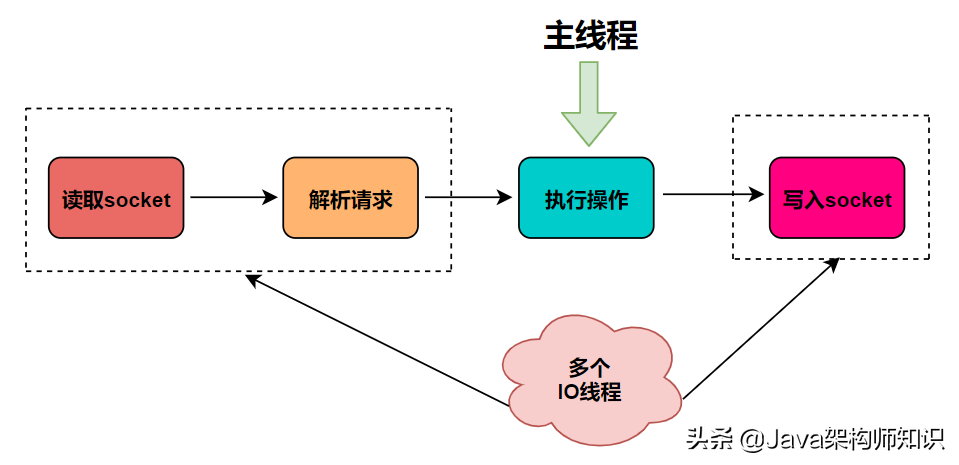

**主要流程**：

1. 主线程负责接收建立连接请求，获取 socket 放入全局等待读处理队列；
2. 主线程通过轮询将可读 socket 分配给 IO 线程；
3. 主线程阻塞等待 IO 线程读取 socket 完成；
4. 主线程执行 IO 线程读取和解析出来的 Redis 请求命令；
5. 主线程阻塞等待 IO 线程将指令执行结果回写回 socket完毕；
6. 主线程清空全局队列，等待客户端后续的请求。

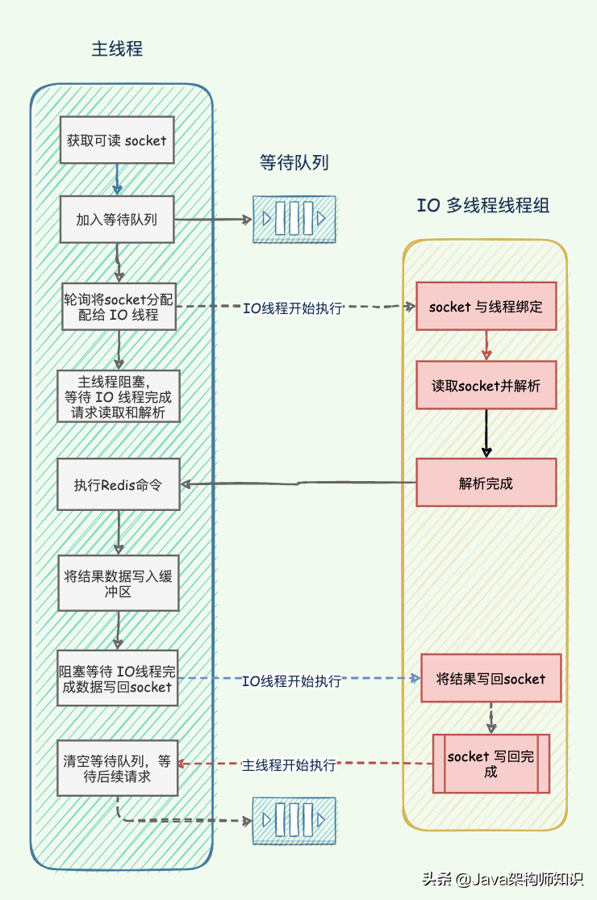

思路：**将主线程 IO 读写任务拆分出来给一组独立的线程处理，使得多个 socket 读写可以并行化，但是 Redis 命令还是主线程串行执行。**

## Redis 6.0 采用多线程后，性能的提升效果如何？

（1）Redis 作者 antirez 在 RedisConf 2019 分享时曾提到：Redis 6 引入的多线程 IO 特性对性能提升至少是一倍以上。

（2）国内也有大牛曾使用 unstable 版本在阿里云 esc 进行过测试，GET/SET 命令在 4 线程 IO 时性能相比单线程是几乎是翻倍了。

## Redis 怎么进行大key删除

（1）低峰期间删除，比如凌晨四点，当然这种方法无法避免阻塞

（2）scan分批删除法

（3）Redis 4.0 以后，可以利用unlink代替del来异步删除

# 2. Redis 持久化

## Redis 有哪些持久化方式

Redis中有两种持久化方式：AOF和RDB（默认）

（1）AOF是以保存命令的形式将数据持久化到磁盘中

（2）RDB是以快照的形式将数据保存到磁盘中

## AOF是写前日志还是写后日志，为什么？

写前日志指的是在执行命令前写记录日志，而写后日志是指执行命令成功后才把命令写到文件中。AOF采用的是写回日志，主要有以下两个好处：

（1）恢复日志时不需要对执行的命令进行格式检查

（2）不会阻塞当前写操作

> 注：AOF写后日志虽然不会阻塞当前操作，但是有可能会给下一个命令带来阻塞风险。

## AOF有哪几种写盘策略？分别有什么优缺点

（1）Always：同步写回。优点是可靠性高，数据基本不丢失；缺点是每个命令都写落盘，性能影响较大

（2）Everysec：每秒写回。优点是性能适中；缺点是可能丢失一秒的数据

（3）No：由操作系统决定什么时候写回。优点是性能好；缺点是宕机时可能丢失的数据较多

## AOF的重写是怎么执行的？

（1）从主进程中fork出子进程，并拿到fork时的AOF文件数据写到一个临时AOF文件中

（2）在重写过程中，redis收到的命令会同时写到AOF缓冲区和重写缓冲区中，这样保证重写不丢失重写过程中的命令

（3）重写完成后通知主进程，**主进程**会将AOF重写缓冲区中的数据追加到子进程生成的文件中

（4）redis会原子的将旧文件替换为新文件，并开始将数据写入到新的aof文件上

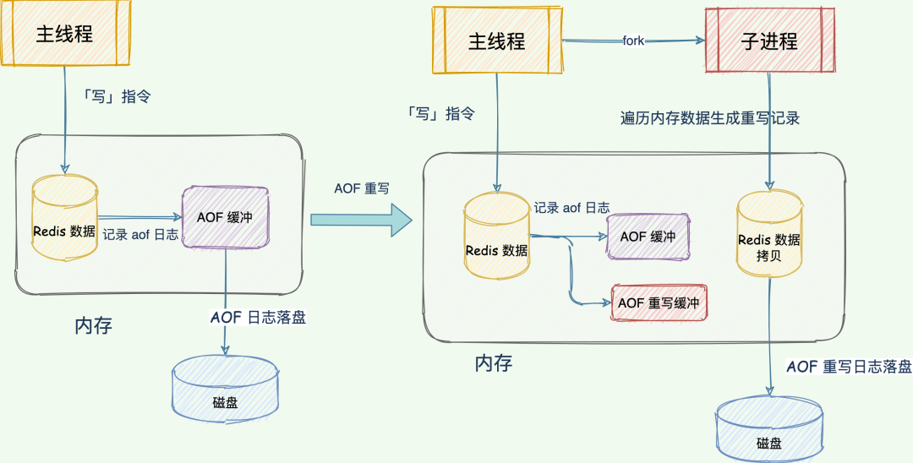

> 注1：AOF重写是将当前redis中的数据翻译成写命令，而不是去读取优化旧的AOF文件
>
> 注2：AOF写入日志是在主线程完成的，而AOF重写是在子进程中执行的

## AOF重写时为什么不共享AOF本身的日志？

（1）父子进程同时写一个文件可能产生竞争问题，要解决竞争（比如加锁）就会影响性能

（2）如果 AOF 重写过程中失败了，那么原本的 AOF 文件相当于被污染了，无法做恢复使用。所以 Redis AOF 重写一个新文件，重写失败的话，直接删除这个文件就好了，不会对原先的 AOF 文件产生影响。等重写完成之后，直接替换旧文件即可。

## AOF重写会阻塞主线程吗？

AOF重写虽然说是在子进程中执行的，但是重写过程中有几种时刻会阻塞主进程： 

（1）在fork子进程时（复制页表数据）

（2）将重写缓冲区的数据写到磁盘上时

（3）使用新AOF文件替换旧文件时

## RDB有哪几种触发方式

（1）执行save命令（在主线程中执行）

（2）执行bgsave命令（fork一个子进程来执行）

（3）Redis停机时，会执行一次save命令

（4）触发RDB条件（save 900 1表示900秒内，如果至少有1个key被修改，则执行bgsave ， 如果是save "" 则表示禁用RDB）

## RDB 的原理是怎么样的

bgsave开始时会fork主进程得到子进程，子进程共享主进程的内存数据。完成fork后读取内存数据并写入 RDB 文件。

fork采用的是copy-on-write技术：

- 当主进程执行读操作时，访问共享内存；
- 当主进程执行写操作时，则会拷贝一份数据，执行写操作。

## AOF和RDB各自有什么优缺点、

**AOF优点：**

（1）有灵活写盘策略，丢失的数据相对较少

**AOF缺点：**

（1）AOF文件体积随着时间的推移会变大

（2）加载时相对于RDB较慢

**RDB优点：**

（1）RDB 采用二进制 + 数据压缩的方式写磁盘，文件体积小

（2）数据恢复速度快

**RDB缺点：**

（1）生成 RDB 文件频率不好把握，频率过低宕机丢失的数据就会比较多；太快，又会消耗额外开销

（2）数据量非常庞大时，fork子进程会比较耗时，影响服务器性能

## AOF和RDB该如何选择

（1）数据不能丢失时，内存快照和 AOF 的混合使用是一个很好的选择

（2）如果允许分钟级别的数据丢失，可以只使用 RDB

（3）如果只用 AOF，优先使用 everysec 的配置选项，因为它在可靠性和性能之间取了一个平衡

## 你们公司采用的是AOF还是RDB做持久化？

我们采用的是AOF和RBD混合持久化。这种持久化能够通过 AOF 重写操作创建出一个同时包含 RDB 数据和 AOF 数据的 AOF 文件， 其中 RDB 数据位于 AOF 文件的开头， 它们储存了服务器开始执行重写操作时的数据库状态： 至于那些在重写操作执行之后执行的 Redis 命令， 则会继续以 AOF 格式追加到 AOF 文件的末尾， 也即是 RDB 数据之后。

## Redis 重启后，是怎么样恢复数据的

（1）AOF持久化开启**且**存在AOF文件时，优先加载AOF文件

（2）AOF关闭或者AOF文件不存在时，加载RDB文件

（3）加载AOF/RDB文件成功后，Redis启动成功

（4）AOF/RDB文件存在错误时，Redis启动失败并打印错误信息

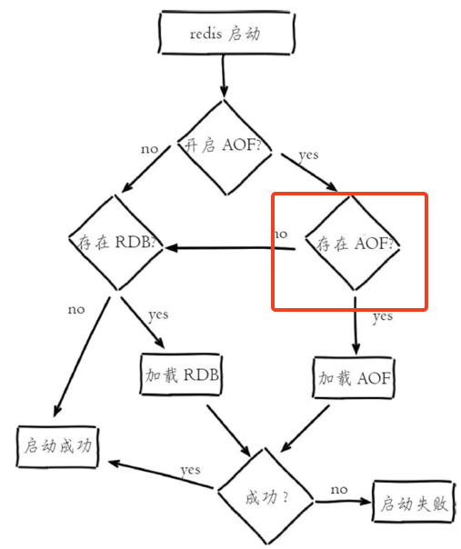

# 3. Redis主从复制

## Redis主从直接如何保证数据的一致性

为了保证副本数据的一致性，主从架构采用了读写分离的方式。

- 读操作：主、从库都可以执行；
- 写操作：主库先执行，之后将写操作同步到从库；

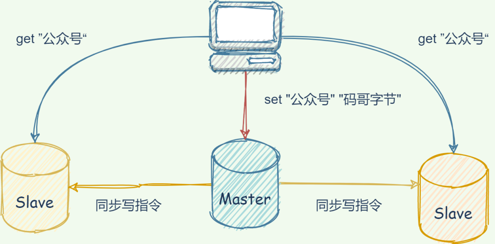

## Redis为什么要采用读写分离

我们可以假设主从库都可以执行写指令，假如对同一份数据分别修改了多次，每次修改发送到不同的主从实例上，就导致是实例的副本数据不一致了。如果为了保证数据一致，Redis 需要加锁，协调多个实例的修改，Redis 自然不会这么干！

## Redis主从复制是怎么进行全量复制的

（1）slave节点请求增量同步

（2）master节点判断replid，发现不一致，拒绝增量同步

（3）master将完整内存数据生成RDB，发送RDB到slave

（4）slave清空本地数据，加载master的RDB

（5）master将RDB期间的命令记录在repl_baklog（环形缓冲区），并持续将log中的命令发送给slave

（6）slave执行接收到的命令，保持与master之间的同步

## Redis主从复制是怎么进行增量复制的

增量同步就是只更新slave与master存在差异的部分数据，但前提是环形缓冲区中的offset没被覆盖：

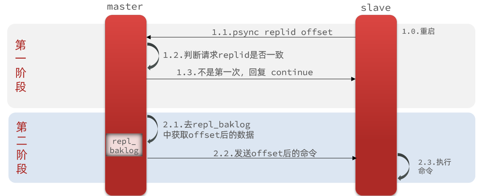

## 全量复制和增量复制的时机

什么时候执行全量同步？

- slave节点第一次连接master节点时
- slave节点断开时间太久，repl_baklog中的offset已经被覆盖时

什么时候执行增量同步？

- slave节点断开又恢复，并且在repl_baklog中能找到offset时

## Redis主从同步应该怎么优化

（1）在master中配置repl-diskless-sync yes启用无磁盘复制，避免全量同步时的磁盘IO

（2）Redis单节点上的内存占用不要太大，减少RDB导致的过多磁盘IO

（3）适当提高repl_baklog的大小，发现slave宕机时尽快实现故障恢复，尽可能避免全量同步

（4）限制一个master上的slave节点数量，如果实在是太多slave，则可以采用主-从-从链式结构，减少master压力

# 4. Redis 哨兵

## Redis的哨兵有哪些作用

（1）**监控**：Sentinel 会不断检查您的master和slave是否按预期工作

（2）**自动故障恢复**：如果master故障，Sentinel会将一个slave提升为master。当故障实例恢复后也以新的master为主

（3）**通知**：Sentinel充当Redis客户端的服务发现来源，当集群发生故障转移时，会将最新信息推送给Redis的客户端

## Redis哨兵是怎么监控集群的

Sentinel基于心跳机制监测服务状态，每隔1秒向集群的每个实例发送ping命令：

（1）主观下线：如果某sentinel节点发现某实例未在规定时间响应，则认为该实例**主观下线**。

（2）客观下线：若超过指定数量（quorum）的sentinel都认为该实例主观下线，则该实例**客观下线**。quorum值最好超过Sentinel实例数量的一半。

## Redis哨兵是怎么进行重新选主的

根据断开时间、优先级、offset、运行ID

（1）首先会判断slave节点与master节点断开时间长短，如果超过指定值（down-after-milliseconds * 10）则会排除该slave节点

（2）然后判断slave节点的slave-priority值，越小优先级越高，如果是0则永不参与选举

（3）如果slave-prority一样，则判断slave节点的offset值，越大说明数据越新，优先级越高

（4）最后是判断slave节点的运行id大小，越小优先级越高

## Redis哨兵怎么执行切换主库命令的

当选出一个新的master后，该如何实现切换呢？流程如下：

（1）sentinel给备选的slave1节点发送slaveof no one命令，让该节点成为master

（2）sentinel给所有其它slave发送slaveof 192.168.150.101 7002 命令，让这些slave成为新master的从节点，开始从新的master上同步数据。

（3）最后，sentinel将故障节点标记为slave，当故障节点恢复后会自动成为新的master的slave节点

## 哨兵之间是怎么组成集群的

哨兵之间是通过pub/sub机制组成集群的。如哨兵1哨兵 1 把自己的 IP（172.16.19.3）和端口（26579）发布到“__sentinel__:hello”频道上，哨兵 2 和 3 订阅了该频道。那么此时，哨兵 2 和 3 就可以从这个频道直接获取哨兵 1 的 IP 地址和端口号。然后，哨兵 2、3 可以和哨兵 1 建立网络连接。通过这个方式，哨兵 2 和 3 也可以建立网络连接，这样一来，哨兵集群就形成了。

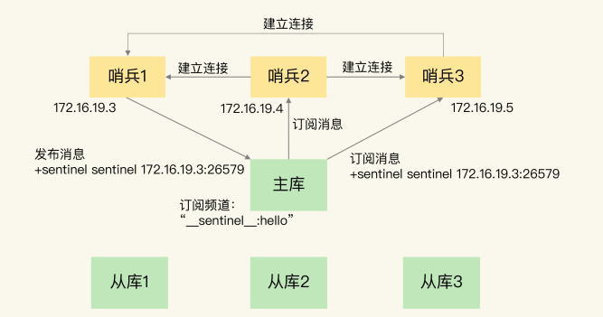

## 哨兵是怎么获取从库的IP和端口

哨兵是通过给主库发送INFO命令来获取从库的IP和端口的，进而与从库建立联系。

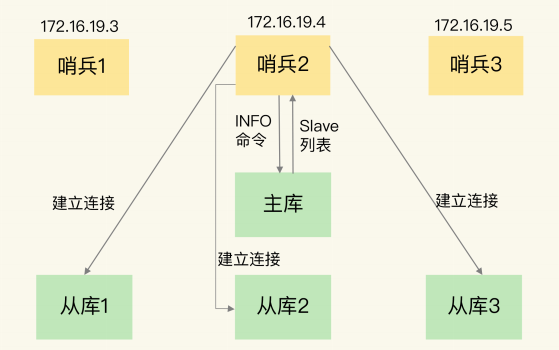

## 由哪个哨兵执行主库切换并通知客户端

哨兵之间也要选主。要想成为Leader哨兵，需要满足以下两个条件：

（1）第一，拿到半数以上的赞成票

（2）第二，拿到的票数同时还需要大于等于哨兵配置文件中的 quorum 值

# 5. Redis切片集群

## Redis 集群最大节点个数是多少

16384 个。这是因为Redis 集群并没有使用一致性hash，而是引入了哈希槽的概念。Redis 集群有16384个哈希槽，每个key通过CRC16校验后对16384取模来决定放置哪个槽，集群的每个节点负责一部分hash槽。

## 为什么哈希槽的数量是16384（2^14）个呢

在redis节点发送心跳包时需要把所有的槽放到这个心跳包里，以便让节点知道当前集群信息，16384=16k，在发送心跳包时使用char进行bitmap压缩后是2k（2 * 8 (8 bit) * 1024(1k) = 16K），也就是说使用2k的空间创建了16k的槽数。

虽然使用CRC16算法最多可以分配65535（2^16-1）个槽位，65535=65k，压缩后就是8k（8 * 8 (8 bit) * 1024(1k) =65K），也就是说需要需要8k的心跳包，Redis作者认为这样做不太值得；并且一般情况下一个redis集群不会有超过1000个master节点，所以16k的槽位是个比较合适的选择。

## 什么是Redis的分区

分区是将你的数据分布在多个Redis实例上，以至于每个实例只包含一部分数据。

## Redis分区的实现方案有哪些

（1）**客户端分区：**由客户端来决定从哪台redis实例来读取或者写入数据

（2）**代理分区：**客户端将请求发送到代理而不是直接发到redis实例上，由代理来决定从哪台redis实例读取或者写入数据

（3）**查询路由：**客户端将请求随机发送到一个任意的redis节点，然后由这个redis节点将请求转发到正确的节点上

> Redis cluster 实现了一种混合模式的查询路由，并不是由redis节点将请求转发到正确的节点上，而是在客户端的帮助下将请求重定向到正确的节点上

## Redis分区的优缺点

### 优点

（1）**扩展数据库的容量：**可以利用多台机器的内存构建更大的数据库

（2）**扩展计算能力：**可以利用多核或者多计算机来扩展计算能力

### 缺点

（1）涉及多个key的操作通常是不被支持的。举例来说，当两个set映射到不同的redis实例上时，你就不能对这两个set执行交集操作。

（2）涉及多个key的redis事务不能使用。

（3）当使用分区时，数据处理较为复杂，比如你需要处理多个rdb/aof文件，并且从多个实例和主机备份持久化文件。

（4）分片中对于实例的添加或删除会很复杂，不过可以使用预分片技术进行改善。

> 预分片技术：分片机制增加或移除实例是非常麻烦的一件事，所以我们可以考虑一开始就开启32个节点实例，当我们可以新增Redis服务器时，我们可以将一半的节点移动到新的Redis服务器。这样我们只需要在新服务器启动一个空节点，然后移动数据，配置新节点为源节点的从节点，然后更新被移动节点的ip信息，然后向新服务器发送slaveof命令关闭主从配置，最后关闭旧服务器不需要使用的实例并且重新启动客户端。这样我们就可以在几乎不需要停机时间时完成数据的移动。

# 6. Redis 缓存

## 缓存穿透

### 什么是缓存穿透

缓存穿透是指用户请求的数据在**缓存中不存在**即没有命中，同时在**数据库中也不存在**，导致用户每次请求该数据都要去数据库中查询一遍。如果有恶意攻击者不断请求系统中不存在的数据，会导致短时间大量请求落在数据库上，造成数据库压力过大，甚至导致数据库承受不住而宕机崩溃。

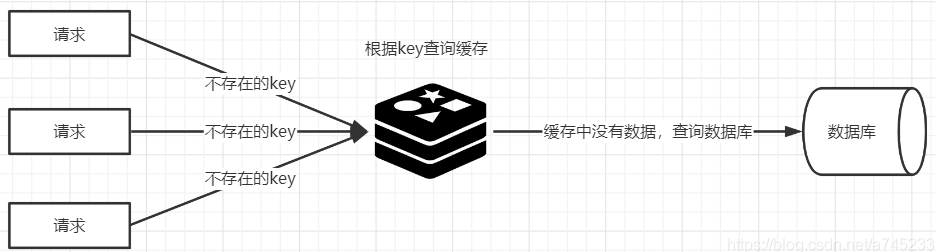

### 解决方案是什么

（1）接口增加业务层级的`Filter`，进行合法校验，这可以有效拦截大部分不合法的请求。

（2）对空的结果进行缓存。但是过期时间设置得较短，一般五分钟内。而这种数据，如果数据库有写入，或者更新，必须同时刷新缓存，否则会导致不一致的问题存在。缺点是会占用一定的内存空间。

（3）使用布隆过滤器。缺点是存在一定的误判，即布隆过滤器中没有缓存中就一定没有，布隆过滤器中有缓存中也不一定有。

### 基本原理

**（1）缓存空值**

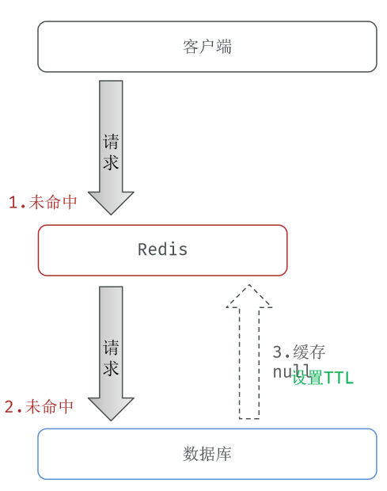

**（2）使用布隆过滤器**

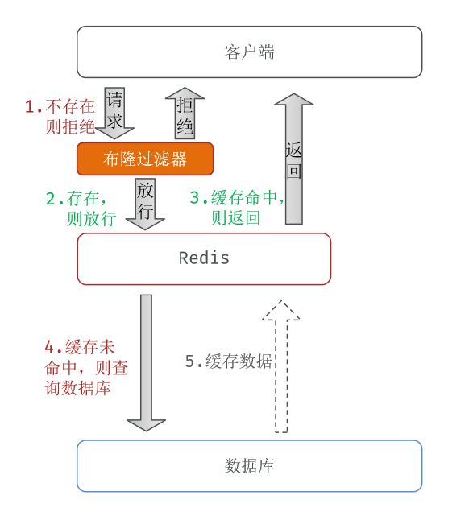

**（3）布隆过滤器原理**

**当一个元素加入布隆过滤器中的时候，会进行如下操作：**

- 使用布隆过滤器中的哈希函数对元素值进行计算，得到哈希值（有几个哈希函数得到几个哈希值）。

- 根据得到的哈希值，在位数组中把对应下标的值置为 1。

**当我们需要判断一个元素是否存在于布隆过滤器的时候，会进行如下操作：**

- 对给定元素再次进行相同的哈希计算；

- 得到值之后判断位数组中的每个元素是否都为 1，如果值都为 1，那么说明这个值在布隆过滤器中，

如果存在一个值不为 1，说明该元素不在布隆过滤器中。

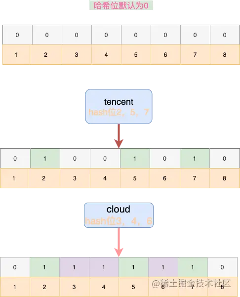

如上图，

1. 有8个hash位，且默认值为0，
2. 当对`tencent`进行散列hash之后，2，5，7位被置为1，
3. 继续对`cloud`进行散列hash后，3，4，6位被置为1。
4. 这时候我们再对其它词汇`other`进行hash，假设散列为1、2、3，1位为0，可以判断该单词不存在集合中。

**（4）解决布隆过滤器不支持删除的问题**

- counting bloom filter

  Counting Bloom Filter将标准 Bloom Filter位数组的每一位扩展为一个小的计数器（counter），在插入元素时给对应的k（k为哈希函数个数）个Counter的值分别加1，删除元素时给对应的k个Counter的值分别减1。Counting Bloom Filter通过多占用几倍的存储空间的代价，给Bloom Filter增加了删除操作。
  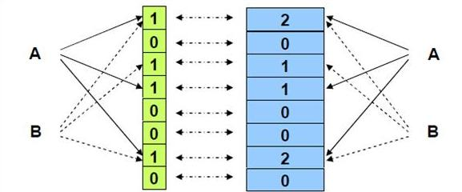

- 布谷鸟过滤器

  对于这种方式有兴趣的读者可以阅读这篇文章：https://juejin.cn/post/6924636027948630029#heading-1

## 缓存击穿

### 什么是缓存击穿

缓存击穿某个**热点的key**失效或者说热点key根本没被缓存过。大并发集中对其进行请求，就会造成大量请求读缓存没读到数据，从而导致高并发访问数据库，引起数据库压力剧增

### 解决方案是什么

（1）排队加锁。在缓存失效后，通过互斥锁或者队列来控制读数据写缓存的线程数量，比如某个key只允许一个线程查询数据和写缓存，其他线程等待。这种方式会阻塞其他的线程，此时系统的吞吐量会下降

（2）热点数据缓存永远不过期。永不过期实际包含两层意思：

- 物理不过期，针对热点key不设置过期时间
- 逻辑过期，把过期时间存在key对应的value里，如果发现要过期了，通过一个**后台的异步线程**进行缓存的构建，**当前线程或者其它线程返回旧数据**

### 基本原理

（1）排队加锁

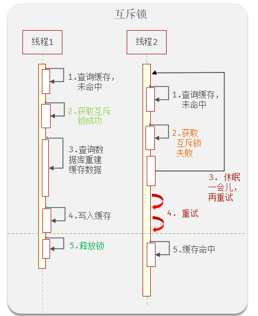

（2）热点数据缓存永远不过期

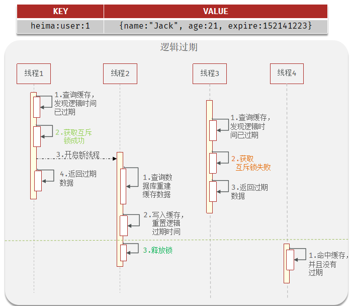

（3）两者优缺点

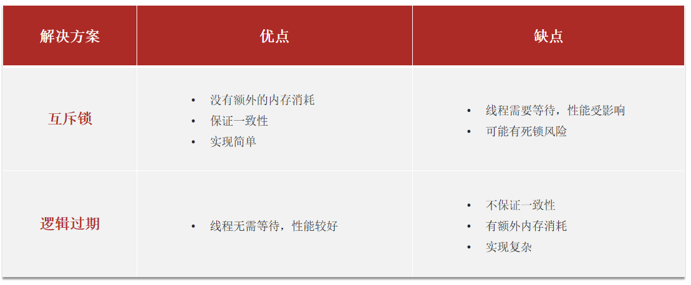

## 缓存雪崩

### 什么是缓存雪崩

缓存雪崩是指在同一时段**大量的缓存key同时失效**或者**Redis服务宕机**，导致大量请求到达数据库，带来巨大压力。

### 解决方案是什么

（1）给不同的Key的TTL添加随机值（解决同时过期）

（2）利用Redis集群提高服务的可用性（解决宕机）

（3）给缓存业务添加降级限流策略，当流量达到一定的阈值，直接返回“系统拥挤”之类的提示，防止过多的请求打在数据库上将数据库击垮。

（4）给业务添加多级缓存，第一级缓存失效的基础上，访问二级缓存，每一级缓存的失效时间都不同

（5）开启Redis持久化机制，一旦宕机恢复后可以快速从磁盘加载数据

### 基本原理

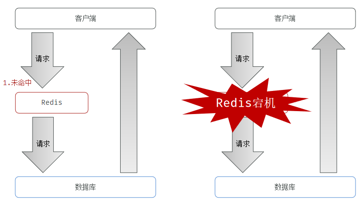

## 缓存预热

### 什么是缓存预热

缓存预热是指系统上线后，提前将相关的缓存数据加载到缓存系统。避免在用户请求的时候，先查询数据库，然后再将数据缓存的问题，用户直接查询事先被预热的缓存数据。

如果不进行预热，那么Redis初始状态数据为空，系统上线初期，对于高并发的流量，都会访问到数据库中， 对数据库造成流量的压力。

### 解决方案是什么

（1）数据量不大的时候，工程启动的时候进行加载缓存动作；

（2）数据量大的时候，设置一个定时任务脚本，进行缓存的刷新；

（3）数据量太大的时候，优先保证热点数据进行提前加载到缓存。

# 参考资料

【1】[Redis布隆过滤器原理与实践](https://juejin.cn/post/6917802871341711367)

【2】[Redis的缓存雪崩、缓存击穿、缓存穿透与缓存预热、缓存降级](https://blog.csdn.net/a745233700/article/details/88088669)

