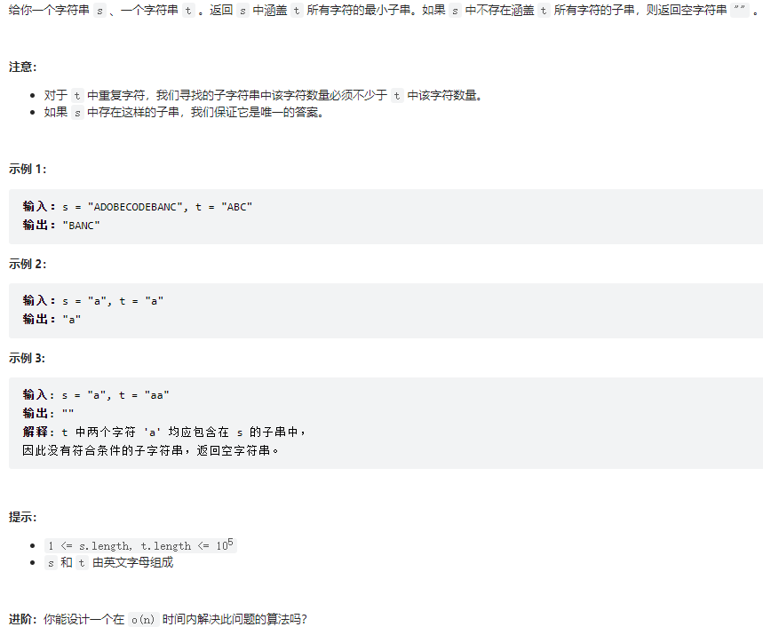
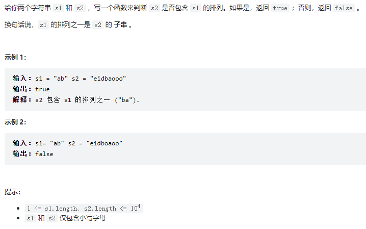
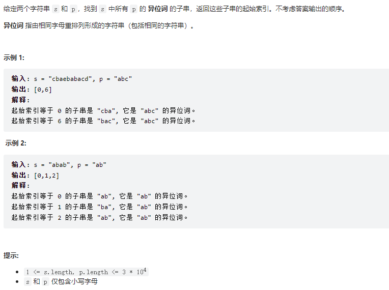

# 1. 滑动窗口

## 代码框架

```java
/* 滑动窗口算法框架 */
void slidingWindow(string s, string t) {
    unordered_map<char, int> need, window;
    for (char c : t) need[c]++;
    
    int left = 0, right = 0;
    int valid = 0; 
    while (right < s.size()) {
        // c 是将移入窗口的字符
        char c = s[right];
        // 增大窗口
        right++;
        // 进行窗口内数据的一系列更新
        ...

        /*** debug 输出的位置 ***/
        printf("window: [%d, %d)\n", left, right);
        /********************/
        
        // 判断左侧窗口是否要收缩
        while (window needs shrink) {
            // d 是将移出窗口的字符
            char d = s[left];
            // 缩小窗口
            left++;
            // 进行窗口内数据的一系列更新
            ...
        }
    }
}
```

## 76. [最小覆盖子串-困难](https://leetcode.cn/problems/minimum-window-substring/)

**题目大意：**



**解题思路：**

（1）初始化两个哈希表need和windows，need用来保存目标字符串t中出现的字符个数，windows用来保存t中的字符在字符串s中出现的次数

```go
    need := make(map[byte]int)
    windows := make(map[byte]int)
```

（2）遍历一遍目标字符串t获取需要的字符及其个数

```go
    for i := range t {
        need[t[i]]++
    }
```

（3）开始遍历字符串s，当遇到一个need中需要的字符时，加入windows并且计数加1，当need中该字符的个数和windows中的字符个数相等时，说明找到了一个合法的字符，然后valid++

```go
for right < len(s) {
    c := s[right]
    right++

    // 进行窗口内数据的一系列更新
    if _, ok := need[c]; ok {
        windows[c]++
        if windows[c] == need[c] {
            valid++
        }
    }
    ...
```

（4）当找到所有字符并且个数符合后就开始收缩窗口，但在收缩前需要先更新结果，因为是最小子串，所以更新的条件是`right -  left < length`

```go
// 找到全部字符并且个数相等后开始收缩窗口
for valid == len(need) {
    // 更新最小覆盖子串
    if right -  left < length {
        start = left
        length = right - left
    }

    // d 是要移除窗口的字符
    d := s[left]
    // 收缩窗口
    left++

    // 进行窗口内数据的一系列更新
    if _, ok := need[d]; ok {
        if need[d] == windows[d] {
            // 不能在这里return，要遍历完整个字符串找到最小的子串
            valid--
        }
        windows[d]--
    }
}
```


**实现代码：**

```go
func minWindow(s string, t string) string {
    left, right, valid := 0, 0, 0
    need := make(map[byte]int)
    windows := make(map[byte]int)

    for i := range t {
        need[t[i]]++
    }

    start, length := 0, math.MaxInt
    for right < len(s) {
        c := s[right]
        right++

        // 进行窗口内数据的一系列更新
        if _, ok := need[c]; ok {
            windows[c]++
            if windows[c] == need[c] {
                valid++
            }
        }

        // 找到全部字符并且个数相等后开始收缩窗口
        for valid == len(need) {
            // 更新最小覆盖子串
            if right -  left < length {
                start = left
                length = right - left
            }

            // d 是要移除窗口的字符
            d := s[left]
            // 收缩窗口
            left++

            // 进行窗口内数据的一系列更新
            if _, ok := need[d]; ok {
                if need[d] == windows[d] {
                    // 不能在这里return，要遍历完整个字符串找到最小的子串
                    valid--
                }
                windows[d]--
            }
        }
    }

    if length != math.MaxInt {
        return s[start:start+length]
    }

    return "" 
}
```

## 567. [字符串的排序-中等](https://leetcode.cn/problems/permutation-in-string/)

**题目大意：**



**解题思路：**

解题思路和上一题类似，不过有以下两点（收缩窗口条件和更新结果）不同：

（1）本题移动 left 缩⼩窗⼝的时机是窗⼝⼤⼩⼤于 t.size() 时，应为排列嘛，显然⻓度应该是⼀样的

（2）当发现 valid == need.size() 时，就说明窗⼝中就是⼀个合法的排列，所以⽴即返回 true

**代码实现：**

```go
func checkInclusion(s1 string, s2 string) bool {
    need := make(map[byte]int)
    windows := make(map[byte]int)
    for i := range s1 {
        need[s1[i]]++
    }

    left, right, valid := 0, 0, 0
    for right < len(s2) {
        c := s2[right]
        right++

        if _, ok := need[c]; ok {
            windows[c]++
            if (windows[c] == need[c]) {
                valid++
            }
        }

        // 由于寻找的是子串，不再是字符个数，所以收缩窗口的条件有所改变
        // 注意这是不能用len(need)而要用len(s1),因为可能含有重复字符
        for right - left >= len(s1) {
            // 注意这是不能用len(s1)而要用len(need),因为可能含有重复字符
            if valid == len(need) {
                return true
            }

            d := s2[left]
            left++
            if _, ok := need[d]; ok {
                if (windows[d] == need[d]) {
                    valid--
                }
                windows[d]--
            }
        } 
    }

    return false
}
```

## 438. [找到字符串中所有异位词-中等](https://leetcode.cn/problems/find-all-anagrams-in-a-string/)

**题目大意：**



**解题思路：**

思路与前面类似，唯一不同的是结果有多个，所以要用数组存起来：

```go
if valid == len(need) {
    res = append(res, left)
}
```

**代码实现：**

```go
func findAnagrams(s string, p string) []int {
    need := make(map[byte]int)
    windows := make(map[byte]int)

    for i := range p {
        need[p[i]]++
    }

    left, right, valid := 0, 0, 0
    res := make([]int, 0, 0)
    for right < len(s) {
        c := s[right]
        right++

        if _, ok := need[c]; ok {
            windows[c]++
            if windows[c]==need[c] {
                valid++
            }
        }

        // 注意这是不能用len(need)而要用len(p),因为可能含有重复字符
        for right - left >= len(p) {
            // 注意这是不能用len(p)而要用len(need),因为可能含有重复字符
            if valid == len(need) {
                res = append(res, left)
            }

            d := s[left]
            left++
            if _, ok := need[d]; ok {
                if windows[d] == need[d] {
                    valid--
                }
                windows[d]--
            }
        }
    }
    return res
}
```

# 参考资料

[1] [labuladong 的算法网站](https://labuladong.github.io/algo/)

